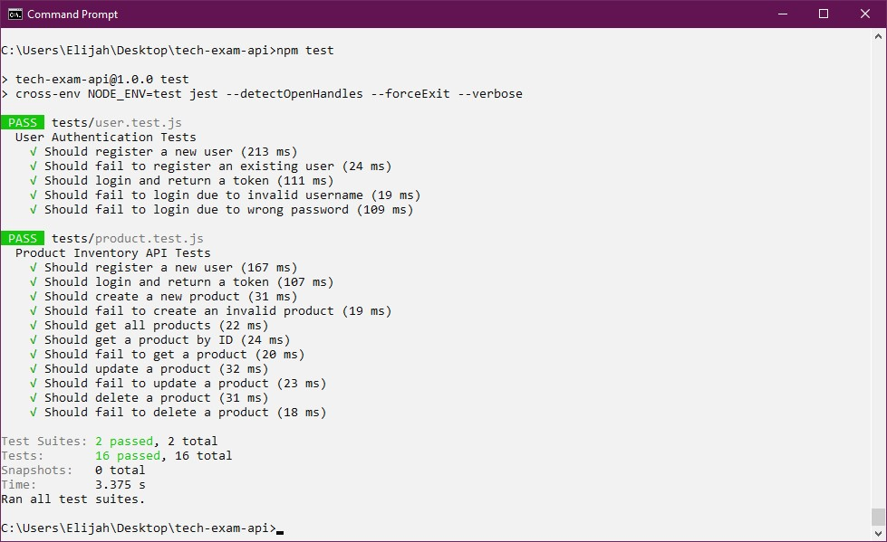
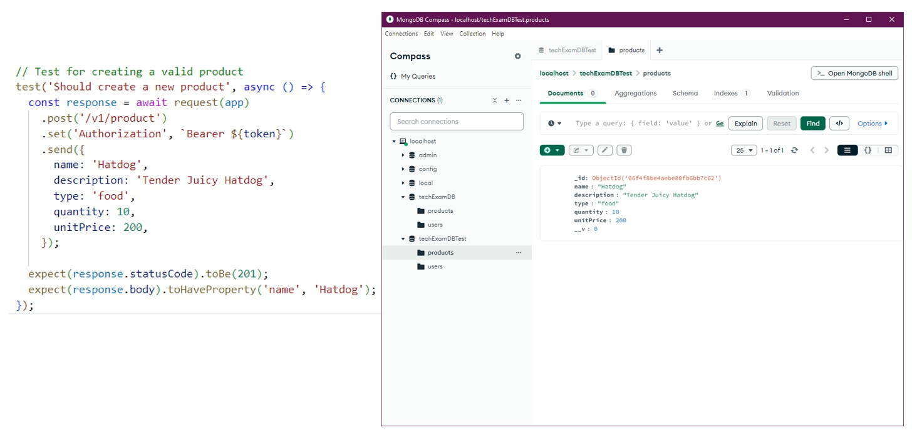
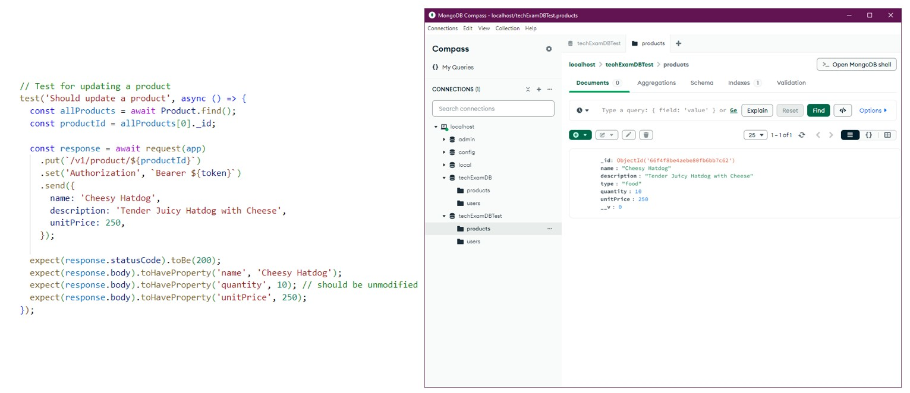
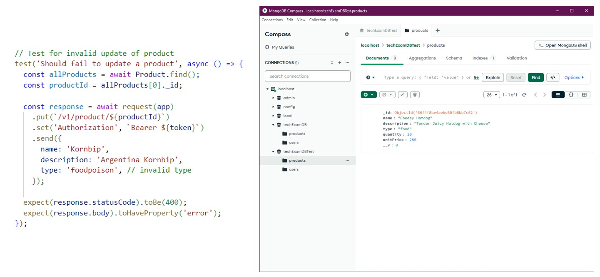
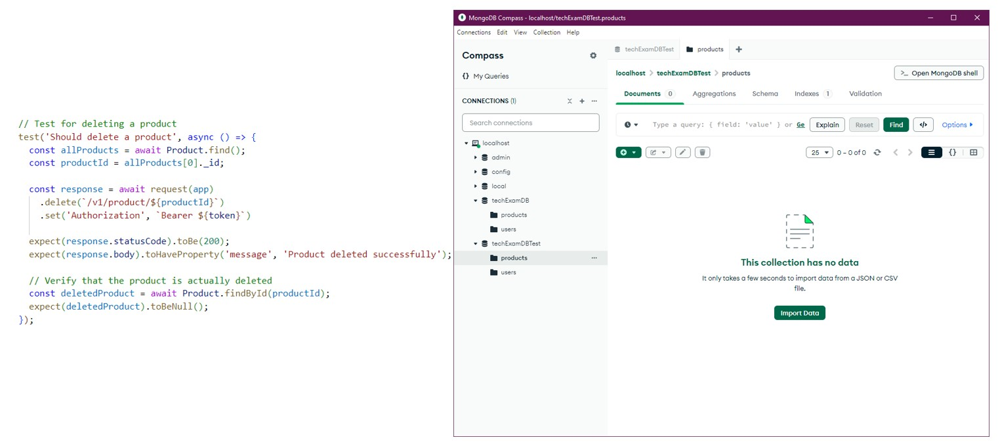
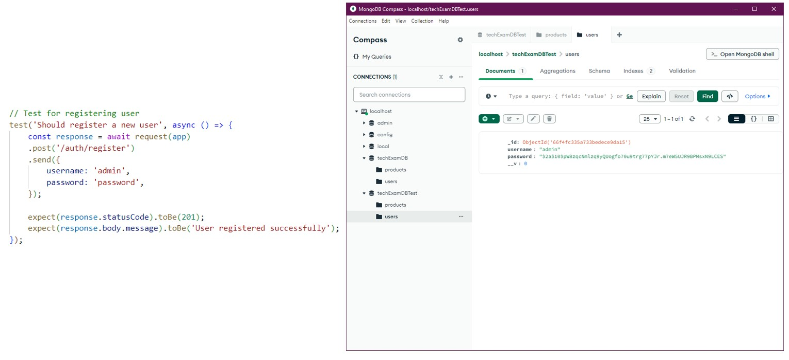

# Technical Exam for API Developer 

This API allows you to manage a product inventory with basic CRUD (Create, Read, Update, Delete) operations. The system also includes user authentication using JWT (JSON Web Tokens).

Created by: Elijah Malazarte

## Requirements
- MongoDB (if using local database)
- Node.js

## Prerequisites
1. Clone this repository using `git clone https://github.com/esmalazarte/tech-exam-api.git`
2. Install the dependencies using `npm install`
2. Create a `.env` file inside the root directory. Sample file contents can be found below:
```
DATABASE_URI=mongodb://127.0.0.1:27017/techExamDB
TEST_DATABASE_URI=mongodb://127.0.0.1:27017/techExamDBTest
SECRET_KEY=secretKey
```

## Usage
1. Run the server using `npm start`
2. Access the server through `http://localhost:3000/`
3. Or run the tests with `npm test`

## API Endpoints

### Products

Note: All API calls must have the header:
```json
{
    "Authorization": "Bearer <token>"
}
```
See Authentication section below for API token

#### Create Product
- Endpoint: `POST /v1/product/`
- Request Body:
```json
{
    "name": "Product Name",
    "description": "Product Description",
    "type": "food",
    "quantity": 10,
    "unitPrice": 200
}
```
- Response:
```json
{
    "_id": "66f4fc335a733bedece9da14",
    "name": "Product Name",
    "description": "Product Description",
    "type": "food",
    "quantity": 10,
    "unitPrice": 200,
    "__v": 0
}
```

#### Get All Products
- Endpoint: `GET /v1/product/`
- Response:
```json
[
    {
        "_id": "66f4fc335a733bedece9da14",
        "name": "Product Name",
        "description": "Product Description",
        "type": "food",
        "quantity": 10,
        "unitPrice": 200,
        "__v": 0
    },
    ...
]
```

#### Get Product By ID
- Endpoint: `GET /v1/product/:id`
- Response:
```json
{
    "_id": "66f4fc335a733bedece9da14",
    "name": "Product Name",
    "description": "Product Description",
    "type": "food",
    "quantity": 10,
    "unitPrice": 200,
    "__v": 0
}
```

#### Update Product
- Endpoint: `PUT /v1/product/:id`
- Request Body:
```json
{
    "name": "Updated Product Name",
    "description": "Updated Product Description",
    "type": "music",
    "quantity": 15,
    "unitPrice": 500
}
```
- Response:
```json
{
    "_id": "66f4fc335a733bedece9da14",
    "name": "Updated Product Name",
    "description": "Updated Product Description",
    "type": "music",
    "quantity": 15,
    "unitPrice": 500,
    "__v": 0
}
```

#### Delete Product
- Endpoint: `DELETE /v1/product/:id`
- Response:
```json
{
    "message": "Product deleted successfully"
}
```

### Authentication

#### Register
- Endpoint: `POST /auth/register`
- Request Body:
```json
{
    "username": "username",
    "password": "password"
}
```
- Response:
```json
{
    "message": "User registered successfully",
    "user": {
        "_id": "66f4fc335a733bedece9da15",
        "username": "username",
        "password": "$2a$10$L306e6M7vlKoWqLG2U/AJOLtwpW.jyYI/FRSzVKcyAIoD1wG3pMV6",
        "__v": 0
    }
}
```

#### Login
- Endpoint: `POST /auth/login`
- Request Body:
```json
{
    "username": "username",
    "password": "password"
}
```
- Response:
```json
{
    "message": "User logged in successfully",
    "token": "<token>"
}
```

## Unit Testing


### Database States for Some Test Cases

#### Create Product


#### Update Product


#### Update Product (Invalid)


#### Delete Product


#### Register User
